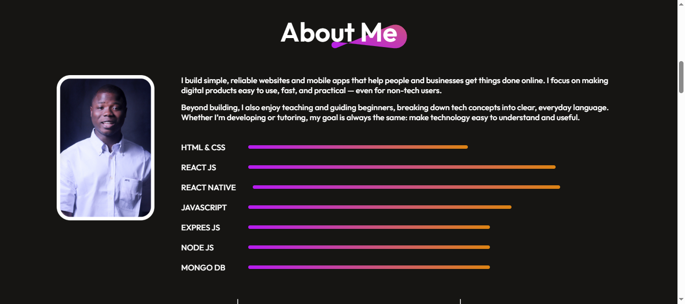

# Tope Bello — Full-Stack & Mobile Developer Portfolio

A modern developer portfolio showcasing my experience, skills, services, and selected projects across full-stack web and mobile development.

🌐 **Live Portfolio:** https://topebello.vercel.app/

## About Me

I'm **Tope Bello**, a Full-Stack and Mobile Developer focused on building simple, reliable, and modern digital products that solve real problems for people and businesses.

I build responsive web applications, backend systems, APIs, databases, and cross-platform mobile applications, with a strong focus on usability, performance, and practical solutions.

## Tech Stack

### Frontend
- React.js
- JavaScript
- HTML5
- CSS3
- Tailwind CSS
- Material UI
- Framer Motion

### Backend
- Node.js
- Express.js
- REST APIs
- Authentication & Authorization

### Database
- MongoDB
- SQL

### Mobile Development
- React Native

### Other Technologies & Tools
- Git & GitHub
- Firebase
- Stripe
- WordPress
- WooCommerce
- Vercel
- Render

## Featured Projects

### 🍽️ Trao Kitchen — Restaurant E-Commerce

A full-stack food ordering platform with authentication, Stripe payments, and order management.

**Tech:** MongoDB, Express.js, React.js, Node.js, Stripe

- **Live Demo:** https://trao-kithen-frontend.onrender.com/
- **GitHub:** https://github.com/ElitepropsDev/E-shop-Mern-Stack

### 🎬 Netflix Clone

A Netflix-inspired movie streaming application with dynamic movie data from the TMDb API and Firebase authentication.

**Tech:** React.js, Firebase, TMDb API

- **Live Demo:** https://netflix-opal-ten.vercel.app/
- **GitHub:** https://github.com/ElitepropsDev/Netflix

### ▶️ YouTube Clone

A responsive YouTube-inspired application featuring video search, recommendations, and dynamic routing.

**Tech:** React.js, YouTube Data API, Material UI, Redux

- **Live Demo:** https://youtube-blush-eight.vercel.app/
- **GitHub:** https://github.com/ElitepropsDev/Youtube

### 🛒 E-Shop MERN Stack

A full-featured e-commerce application with product management, authentication, cart functionality, and a complete MERN stack backend.

**Tech:** MongoDB, Express.js, React.js, Node.js

- **Live Demo:** https://eshopx-live.vercel.app/
- **GitHub:** https://github.com/ElitepropsDev/E-shop-Mern-Stack

### 🎓 EduHub Learning Platform

A modern educational platform focused on content delivery, intuitive navigation, and a smooth learning experience.

**Tech:** React.js, Tailwind CSS, React Router, Vercel

- **Live Demo:** https://eduhub-roan.vercel.app/
- **GitHub:** https://github.com/ElitepropsDev/EduHub

### 📚 Learning Management System

A full-featured LMS that allows users to enroll in courses, track progress, and access learning materials through a modern interface and backend system.

**Tech:** React.js, Node.js, Express.js, MongoDB

- **Live Demo:** https://lms-ecp.vercel.app/
- **GitHub:** https://github.com/ElitepropsDev/LMS

### 📱 ShopAppX

A mobile e-commerce application designed to provide a smooth and convenient shopping experience.

**Tech:** React Native, Node.js, Express.js, MongoDB

- **GitHub:** https://github.com/ElitepropsDev/ShopAppX

### 📱 SkillForge

A mobile learning platform inspired by modern course platforms, featuring course enrollment, payments, progress tracking, real-time communication, and notifications.

**Tech:** React Native, Node.js, Express.js, MongoDB

- **GitHub:** https://github.com/ElitepropsDev/SkillForge-Lms

## Services

### Web Application Development
Building responsive, scalable, and user-friendly web applications tailored to specific business and product requirements.

### Mobile App Development
Building cross-platform mobile applications with React Native, focusing on usability, performance, and consistent experiences.

### API Development & Integration
Developing and integrating APIs that allow applications and external services to communicate securely and efficiently.

### Database Design & Management
Designing and managing databases for reliable data storage, efficient retrieval, and scalable applications.

### Maintenance & Debugging
Fixing bugs, implementing updates, improving existing applications, and maintaining application performance.

### Deployment & Hosting
Deploying applications and configuring production environments using modern hosting and cloud platforms.

## What I Build

- Full-stack web applications
- REST APIs
- E-commerce platforms
- Learning management systems
- Mobile applications
- Authentication systems
- Payment integrations
- Third-party API integrations
- Database-driven applications
- Responsive user interfaces

## Contact

I'm available for new projects, collaborations, and development opportunities.

- 🌐 **Portfolio:** https://topebello.vercel.app/
- 📧 **Email:** belltop12@gmail.com
- 📍 **Location:** Lagos, Nigeria

---

© 2026 Tope Bello. All rights reserved.
